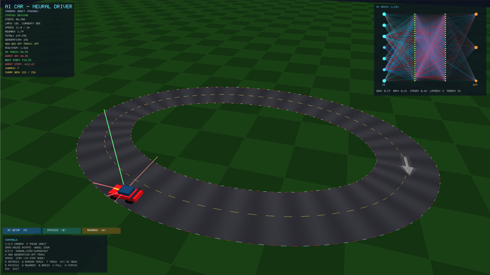
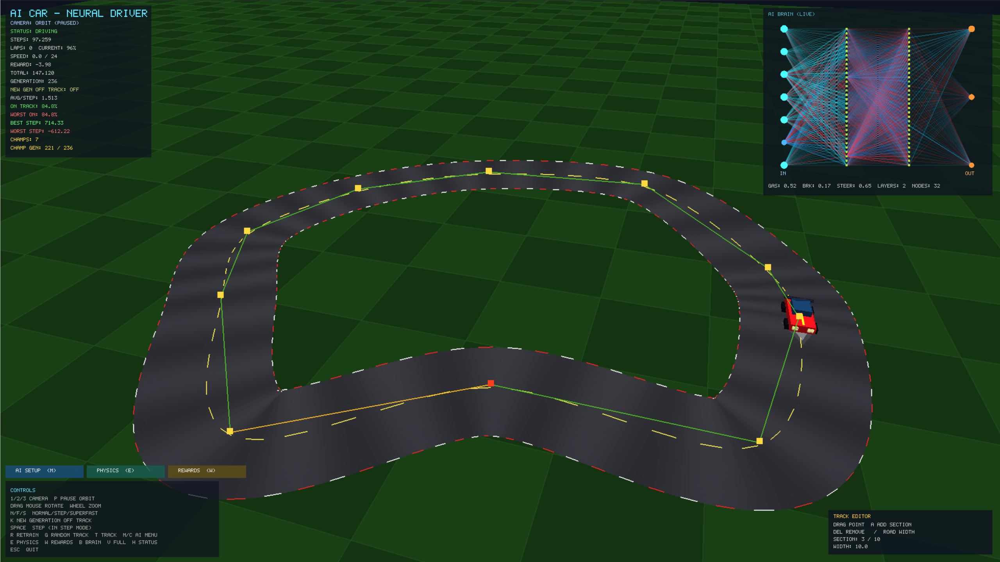
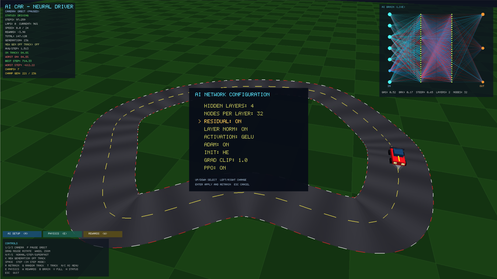
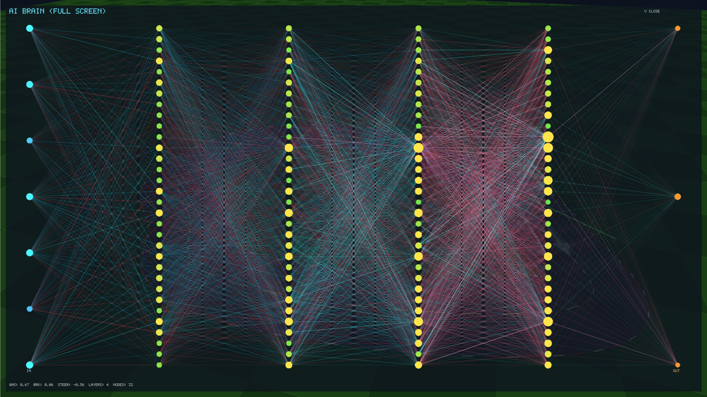
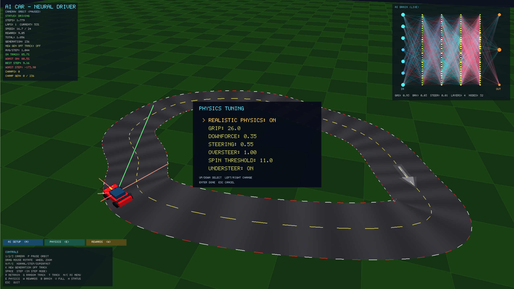
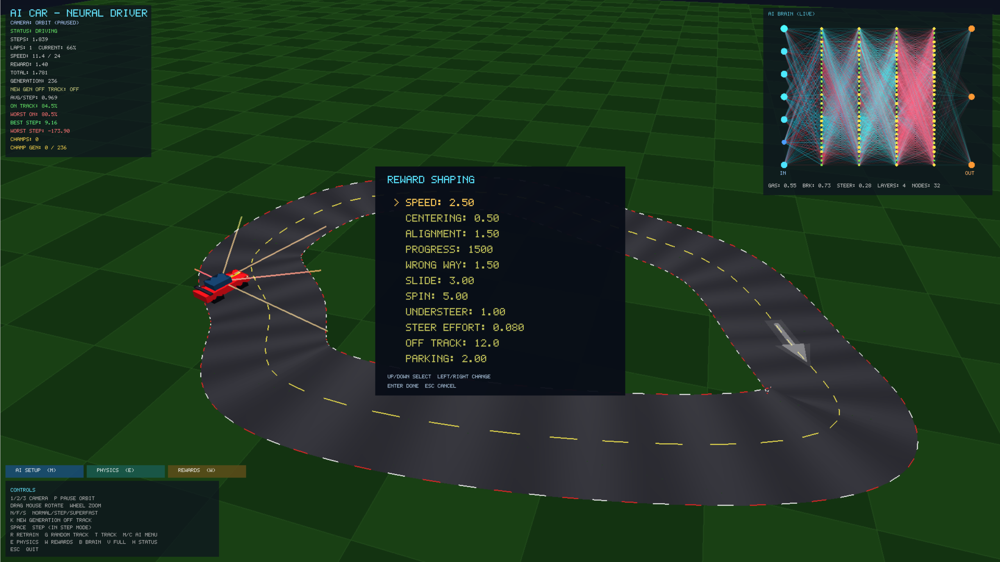
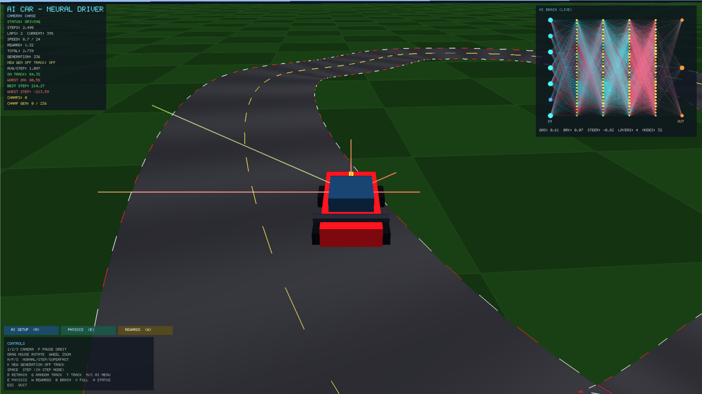
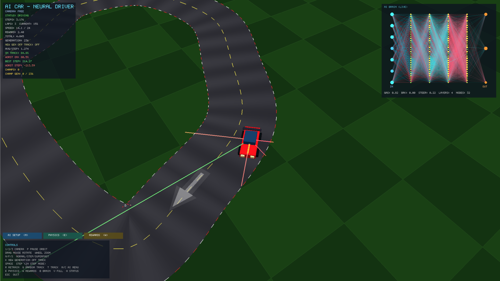

# 🏎️ AiTest — Neural Network Self-Driving Car

A from-scratch self-driving car experiment in **C# / .NET 10**: a deep feed-forward neural network learns to drive a spline track using vision rays + PPO-style reinforcement learning. Rendering is raw **SDL2 + OpenGL** (no game engine).










## ✨ Features

- 🧠 **From-scratch neural net** — feed-forward + backprop, no ML library (defaults to 2 layers × 32 nodes, 5-ray vision)
- 🔬 **Depth-scaling techniques** — residual skips, LayerNorm, ReLU/GELU/tanh switch, Adam, He/Xavier/orthogonal init, gradient clipping, depth-scaled LR, weight + bias decay, MaxNorm caps, activation clamps, output temperature scaling
- 🚗 **PPO-style brain (`CarBrain`)** — 5 vision rays → steer/throttle/brake, clipped advantage + running critic, entropy bonus, guided cornering targets, recovery lessons + rejoin bonus when off track, training annealing (exploration and teacher guidance fade as it learns)
- 🧬 **Generational evolution** — death sends the car back to the start line; distance-based fitness with champion elitism (best genome kept, the rest mutate from it); `R` is an extinction event
- 📊 **Evolution dashboard** — on-track %, worst on-track %, best/worst step reward, avg/step, champion count + champion generation; K mode swaps to best/worst generational distance records (multi-lap %, updated live)
- 🏁 **Realistic car physics** — kinematic bicycle + friction circle: understeer (plow wide), oversteer (drift), spin-outs, brake zones, aero drag, downforce grip
- 🔧 **Physics tuning menu** — toggle realistic/arcade, adjust grip, downforce, steering, oversteer, spin threshold, understeer (`E` or click **[PHYSICS]**)
- 🏆 **Reward shaping menu** — tune all 11 weights: speed, centering, alignment, progress, wrong-way, slide, spin, understeer, steer effort, off-track, parking anti-stall (`W` or click **[REWARDS]**)
- 👁️ **5-ray vision** — left, left-forward, forward, right-forward, right (`VisionRays.Default5`; `Wide7` available in code)
- 🛣️ **Spline track** — Catmull-Rom closed loop, twist-proof editor (invalid drags rejected), spatial-hash ray casting
- 🎲 **Track randomizer** — always-drivable star-shaped loops (`G`)
- 🛠️ **In-app track editor** — drag control points (`T` mode), add/remove sections, adjust road width
- 🎮 **3D renderer** — lit ground, road + curbs + dashed centerline, slim translucent start-line arrow, car mesh, vision-ray debug lines (starts at 1920×1080; correct OpenGL blend enums)
- 📷 **3 camera modes** — Orbit / Chase / Free (keys `1/2/3`)
- ⚡ **Speed modes** — Normal / Step-through (`SPACE`) / SuperFast training
- 🖥️ **Live HUD** — 5×7 bitmap font (now with comma glyph + thousand separators), stats readout (steps, laps, on-track %, best/worst, avg/step, champs), gas/brake display, brain visualization with 2px activity-boosted weight lines (live signal paths glow)
- ⚙️ **AI Setup menu** — layers, nodes, residual, LayerNorm, activation, Adam, init scheme, grad clip, PPO (`M`/`C` or click **[AI SETUP]**, `↑/↓` select, `←/→` change, `Enter` apply + retrain)
- 💻 **Headless mode** — `dotnet run -- --headless [steps]` trains with no window/GPU

## 🚀 Getting Started

```bash
dotnet build AiTest.sln
dotnet run --project AiTestClient
# headless training:
dotnet run --project AiTestClient -- --headless 6000
```

Requires .NET 10 SDK + SDL2 native libs.

## 🎹 Controls

| Key | Action |
|-----|--------|
| `1/2/3` | Orbit / Chase / Free camera |
| `N/F/S` | Normal / Step / SuperFast speed |
| `SPACE` | Advance one step (in Step mode) |
| `R` | Retrain (new brain) |
| `G` | Random track |
| `M` / `C` | AI config menu (or click [AI SETUP]) |
| `E` | Physics tuning menu (or click [PHYSICS]) |
| `W` | Reward shaping menu (or click [REWARDS]) |
| `T` | Track editor |
| `B` | Toggle brain overlay |
| `V` | Fullscreen brain |
| `H` | Toggle status panel |
| `P` | Pause orbit camera |
| `K` | New generation off-track mode (HUD shows generational distance records) |
| `ESC` | Quit / close menu |

## 📁 Project Structure

- `AiModel_V1/` — 🧠 `NeuralNetwork.cs`, `CarBrain.cs`, `VisionRays.cs`, `TrainingConfig.cs` (world-agnostic AI)
- `AiTestClient/` — 🎮 `Program.cs` (game loop), `Renderer.cs`, `Hud.cs`, `GameWindow.cs`, `World/` (`Car.cs`, `Track.cs`, `Simulation.cs`, `PhysicsConfig.cs`, `RewardConfig.cs`), `Native/` (SDL/OpenGL bindings)
- `Images/` — 📸 screenshots
